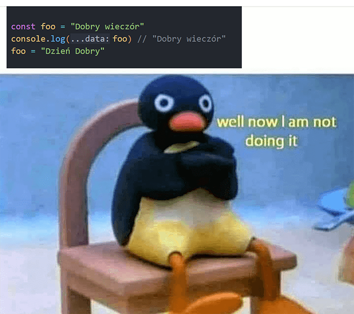

# Zmienne

Dane jakie zmienne przyjmują w JavaScript

Data Types | Description
------------ | -------------
`var` | Można zmieniać jej wartości do woli a odwoływanie się do niej jest możliwe w całym skrypcie
`let` | Można zmieniać jej wartości do woli a odwoływanie się do niej jest możliwe w danym bloku skryptu w którym jest zamknięta
`const` | Po deklaracji zmiennej nie da się zmienić jej wartości

## Const



> `foo` nadal zawiera "Dobry Wieczór" ale nie da się jej zmienić

## Let

Poniżej przykład kodu w którym nie powinniśmy używać let:

```js
for (let i = 1; i <= 5; i++) {
  let foo = i
}

console.log(foo) // undefined
```

> nie mam pojęcia jaki debil napisałby ten kod ale niech zostanie na potrzeby przykładu

## Var

Ten sam dziwny kod ale z var:

```js
for (let i = 1; i <= 5; i++) {
  let foo = i
}

console.log(foo) // 5
```

> tym razem zadziałał bo var jest globalny
