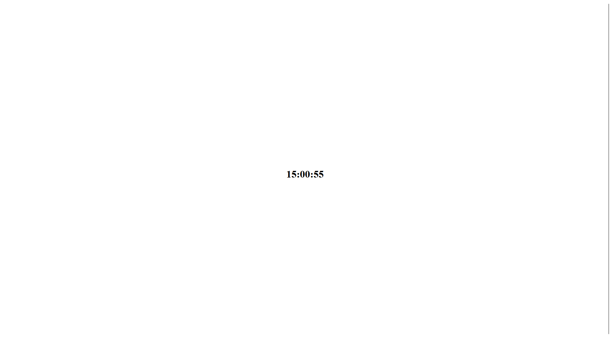

# Zegarek

## Kod

```html
<!DOCTYPE html>
<html lang="en">
  <head>
    <meta charset="UTF-8" />
    <meta http-equiv="X-UA-Compatible" content="IE=edge" />
    <meta name="viewport" content="width=device-width, initial-scale=1.0" />
    <title>Zegar</title>
  </head>
  <body style="height: 100vh; display: grid; place-items: center">
    <div id="zegar"></div>

    <script>
      const startTime = () => {
        const today = new Date();
        let h = today.getHours();
        let m = today.getMinutes();
        let s = today.getSeconds();
        m = checkTime(m);
        s = checkTime(s);
        document.getElementById("zegar").innerHTML =
          "<h1>" + h + ":" + m + ":" + s + "</h1>";
        setTimeout(startTime, 1000);
      };

      const checkTime = (i) => {
        if (i < 10) {
          i = "0" + i;
        } // add zero in front of numbers < 10
        return i;
      };

      startTime();
    </script>
  </body>
</html>

```

## Wynik


