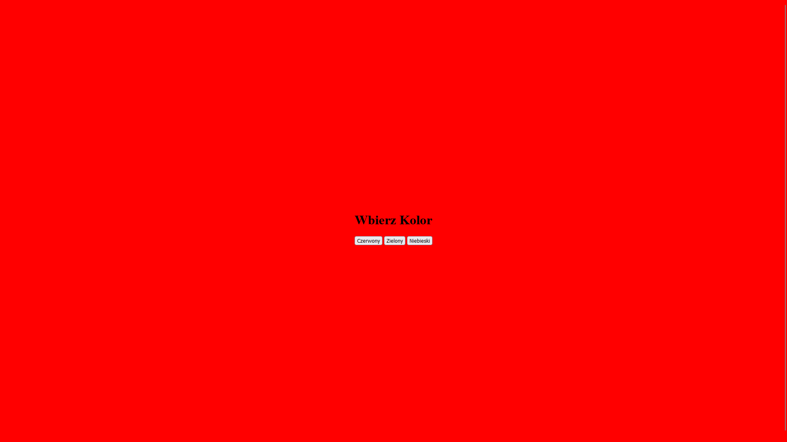

# Zmiana koloru

## Kod

```html
<!DOCTYPE html>
<html lang="en">
<head>
    <meta charset="UTF-8">
    <meta http-equiv="X-UA-Compatible" content="IE=edge">
    <meta name="viewport" content="width=device-width, initial-scale=1.0">
    <title>Kalkulator</title>
</head>
<body style="height: 100vh; display: grid; place-items: center;">
<div>
    <h1>Wbierz Kolor</h1>
    <button onClick="setColor('red')">Czerwony</button>
    <button onClick="setColor('green')">Zielony</button>
    <button onClick="setColor('blue')">Niebieski</button>

    <script>
        const setColor = (color) => {
            document.body.style.backgroundColor = color;
        }
    </script>

</div>
</body>
</html>
```

## Wynik


