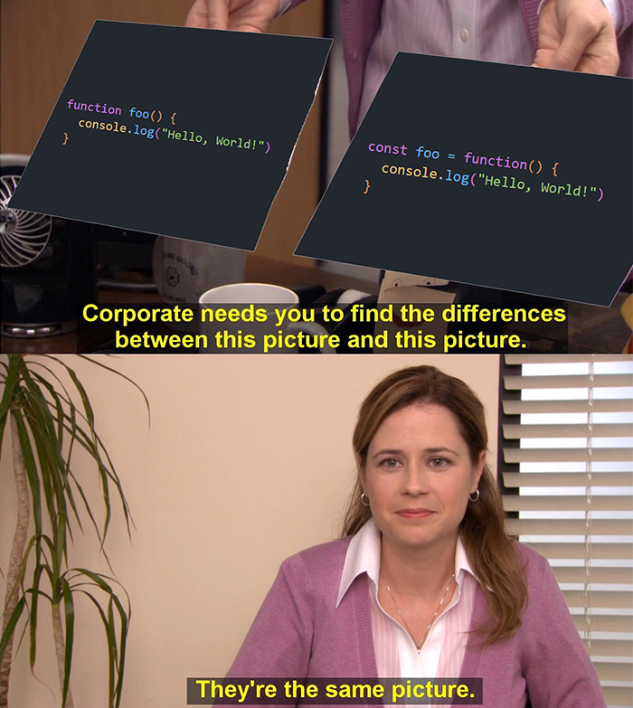

# Funkcje

Dobra szybko działamy z tematem:

W JavaScript możemy tworzyć funkcje w 3 różnych sposobach:

```js
function foo() {
  console.log("Hello, World!")
}
```

> ^ To są funkcje zwykłe używane za komuny

```js
const foo = function() {
  console.log("Hello, World!")
}
```

> ^ to jest jakiś dziwny wytwór JS ale też zadziała

```js
const foo = () => {
  console.log("Hello, World!")
}
```

> ^ A to są super nowoczesne funkcje strzałkowe wprowadzone w ES6 (chyba nie pamiętam i mnie to nie obchodzi)



```js
const foo = () => {
  console.log("Hello, World!")
}

foo() // nie zwraca nic ale wyświetli się Hello, World!
```

```js
const foo = () => {
  return "Hello, World!"
}

foo() // a tutaj nic się nie wyświetli ale zwróci Hello, World!
```

Dobra a teraz argumenty:

```js
const foo = (a, b) => {
  return a + b
}

foo(1, 2) // zwróci 3
```
