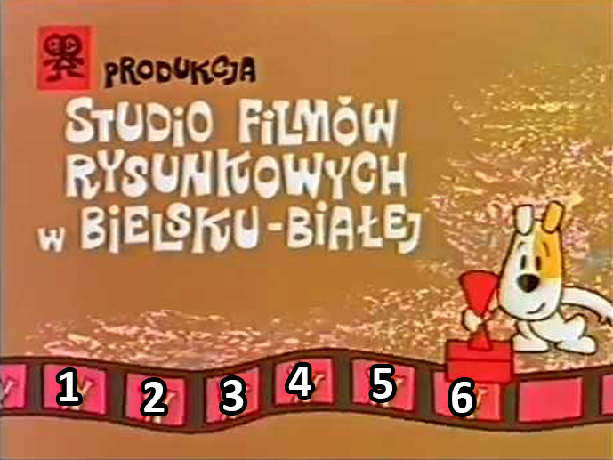

# Pętle

W JS mamy 5 głównych rodzaji pętli:

* for
* while
* do...while
* for...in
* for...of

## for

Pętla for jest najczęściej używaną pętlą w JS. Składa się z 3 części:

* inicjalizacja - wykonywana tylko raz na początku pętli
* warunek - jeśli jest spełniony, pętla się wykona
* inkrementacja - wykonywana na końcu każdej iteracji

```js
for (inicjalizacja; warunek; inkrementacja) {
  // kod który się wykona
}
```

Przykład:

```js
for (let i = 0; i < 10; i++) {
  console.log(i)
}
```

## while

Pętla while jest używana gdy nie wiemy ile razy ma się wykonać pętla. Wykonywana jest dopóki warunek jest spełniony.

```js
while (warunek) {
  // kod który się wykona
}
```

Przykład:

```js
let i = 0
while (i < 10) {
  console.log(i)
  i++
}
```

## do...while

Pętla do...while jest używana gdy nie wiemy ile razy ma się wykonać pętla. Wykonywana jest dopóki warunek jest spełniony. Różnica pomiędzy while a do...while jest taka, że do...while wykona się przynajmniej raz.

```js
do {
  // kod który się wykona
} while (warunek)
```

Przykład:

```js
let i = 0
do {
  console.log(i)
  i++
} while (i < 10)
```

## for...in

Pętla for...in służy do iterowania po obiektach. Wykona się tyle razy ile jest właściwości w obiekcie.

```js
const obj = {
  name: 'Jan',
  age: 20,
  city: 'Warszawa'
}

for (const key in obj) {
  console.log(key, obj[key])
}
```

## for...of

Pętla for...of służy do iterowania po tablicach. Wykona się tyle razy ile jest elementów w tablicy.

```js
const arr = [1, 2, 3, 4, 5]

for (const el of arr) {
  console.log(el)
}
```

## forEach

Metoda forEach służy do iterowania po tablicach. Wykona się tyle razy ile jest elementów w tablicy.

```js
const arr = [1, 2, 3, 4, 5]

arr.forEach((el) => {
  console.log(el)
})
```

## break

Polecenie break służy do przerwania pętli. Jeśli w pętli znajdziemy break, pętla się zatrzyma.

```js
for (let i = 0; i < 10; i++) {
  if (i === 5) {
    break
  }
  console.log(i)
}
```

## continue

Polecenie continue służy do przerwania aktualnej iteracji pętli. Jeśli w pętli znajdziemy continue, pętla przejdzie do następnej iteracji.

```js
for (let i = 0; i < 10; i++) {
  if (i === 5) {
    continue
  }
  console.log(i)
}
```


